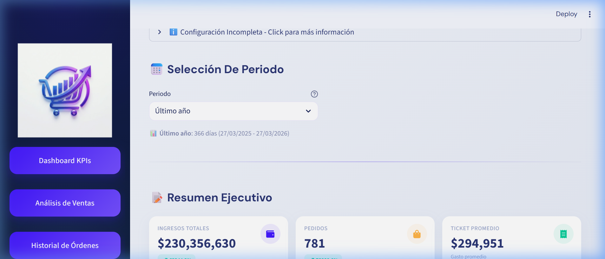
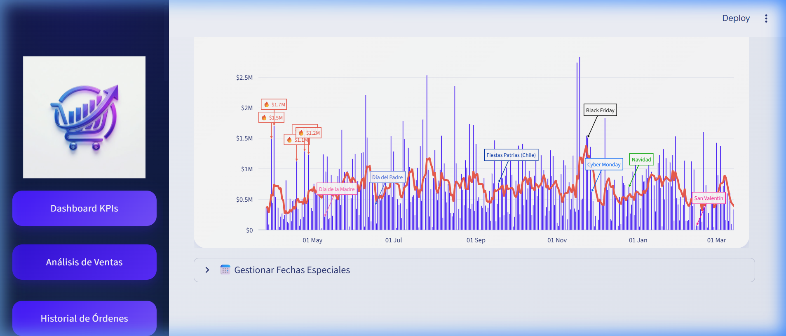

# 📊 Analytics & E-commerce Data Pipeline - Generic Edition


An automated and **100% configurable** ETL pipeline that extracts data from **Google Analytics 4**, **WooCommerce**, and **Facebook**, processes it, and visualizes it through interactive Streamlit dashboards.

> **🆕 Generic Version**: Now you can configure your own credentials through a web interface, without modifying any code. Ideal for multiple projects or clients.

---

## 🖼️ Dashboard Preview


*Executive Summary view showcasing key performance indicators.*


*Detailed sales trend analysis with automated event annotations.*

---

## 🚀 Features

- ✅ **100% Generic System** - Configurable for any store/project without modifying code.
- ✅ **Web Configuration Interface** - Intuitive setup via Streamlit.
- ✅ **Real-Time Validation** - Test your credentials before saving.
- ✅ **Multi-Source** - WooCommerce + Google Analytics 4 + Facebook.
- ✅ **Automated Extraction** with incremental loading.
- ✅ **Docker Ready** - Containerization for easy deployment.
- ✅ **CI/CD Pipeline** - GitHub Actions for automated testing and deployment.
- ✅ **Structured Logging** with file rotation.
- ✅ **Automatic Retry Logic** for external APIs.
- ✅ **Automated Tests** with pytest.
- ✅ **Interactive Dashboards** with Streamlit.
- ✅ **Query Optimization** with database indexes.
- ✅ **Secure Credential Management** via environment variables.

---

## 📋 Prerequisites

- **Python 3.10+**
- **Credentials for the services you wish to connect:**
  - WooCommerce: Store URL, Consumer Key, Consumer Secret.
  - Google Analytics 4: Service Account JSON file, Property ID.
  - Facebook: Access Token, Page ID (optional).
- **Internet Access** for external APIs.

---

## ⚡ Quick Start (Recommended)

### 🚀 One-Click Installation (Windows)

1. **Double-click on:**
   ```
   SETUP.bat
   ```
   The installer will verify Python, create a virtual environment, and install all dependencies automatically.

2. **Launch the application:**
   ```
   LAUNCH.bat
   ```

3. **Configure your credentials** in the web interface.

4. **Done!** 🎉

> 📖 **Full Quick Start Guide**: See [docs/en/QUICKSTART.md](docs/en/QUICKSTART.md)  
> 📦 **For Distribution**: See [DISTRIBUCION.md](DISTRIBUCION.md)

---

## 🔧 Manual Installation (Advanced)

### 1. Clone or download the project
```bash
cd "path/to/ExtraerDatosGoogleAnalitics_Generic"
```

### 2. Create virtual environment
```powershell
python -m venv venv
.\venv\Scripts\activate
```

### 3. Install dependencies
```bash
pip install -r requirements.txt
```

### 4. Configure Credentials (NEW - Generic Version)

#### Option A: Web Interface (Recommended) ⭐
1. Start the dashboard:
   ```bash
   streamlit run dashboard/app_woo_v2.py
   ```
2. In the sidebar, click on **"⚙️ Configure Credentials"**.
3. Follow the configuration wizard.
4. Click **"🔍 Test Connection"** to validate.
5. Click **"💾 Save Configuration"**.
6. Restart the application.

#### Option B: Manual (.env file)
1. Copy the template:
   ```bash
   copy .env.example .env
   ```
2. Edit `.env` with your credentials.

📚 **Detailed Guide**: See [docs/en/SETUP_GUIDE.md](docs/en/SETUP_GUIDE.md) for step-by-step instructions.

---

## 📖 Usage

### Manual Execution
- **Extract Google Analytics data**: `python etl/extract_analytics.py`
- **Extract WooCommerce data**: `python etl/extract_woocommerce.py`
- **Launch Dashboard**: `python -m streamlit run dashboard/app_woo_v2.py`

### Automatic Execution with Scheduler
```bash
python scheduler.py
```
The scheduler will automatically run:
- **2:00 AM**: Google Analytics extraction.
- **3:00 AM**: WooCommerce extraction.

---

## 🐳 Docker Deployment

**Quick Start:**
```bash
# Windows
docker-start.bat

# Linux/Mac
chmod +x docker-start.sh
./docker-start.sh
```

Access the dashboard at: **http://localhost:8501**

---

## 📁 Project Structure
```
AnalyticsPipeline/
├── config/              # Configuration & Logging
├── etl/                 # ETL Extractors (GA4, Woo, FB)
├── utils/               # Shared utilities (DB, API, etc.)
├── dashboard/           # Streamlit Dashboard files
├── tests/               # Test suite
├── logs/                # Automated log files
├── data/                # SQLite Databases
├── docs/                # Multi-language documentation
├── assets/              # Static assets and screenshots
└── run_pipeline.py      # Unified execution entry point
```

---

## 📈 Future Improvements
- [ ] Support for more e-commerce platforms (Shopify, Magento).
- [ ] Integration with more social networks (Instagram, TikTok).
- [ ] Migration to PostgreSQL for better concurrency.
- [ ] REST API for programmatic data access.

---

## 📞 Support and Documentation
- 📖 **English Documentation**: Available in the `docs/en/` directory.
- 🇪🇸 **Spanish Documentation**: See `README_ES.md`.

**Last updated**: March 2026  
**Version**: 1.1 - Generic Edition
