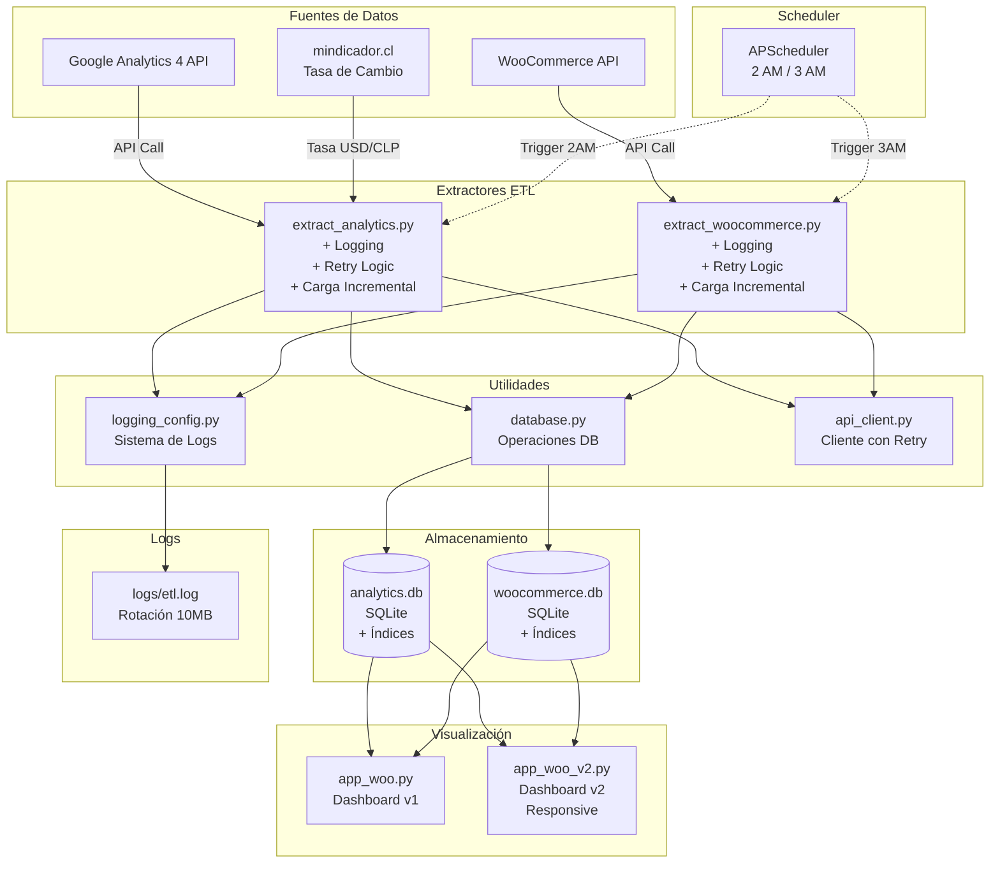

# Arquitectura del Sistema

## Diagrama de Flujo de Datos



---

## Capas de la Arquitectura

### 1. **Capa de Extracción (ETL)**

#### Responsabilidades
- Conectar con APIs externas (GA4, WooCommerce)
- Manejar autenticación y credenciales
- Implementar retry logic automático
- Realizar carga incremental (solo datos nuevos)

#### Componentes
- `extract_analytics.py`: Extrae 7 reportes de GA4
- `extract_woocommerce.py`: Extrae órdenes y productos

#### Características
- **Logging estructurado** en cada paso
- **Type hints** para mejor mantenibilidad
- **Decorador @log_execution_time** para métricas de performance

---

### 2. **Capa de Utilidades (Utils)**

#### `database.py`
```python
# Funciones principales
- get_db_connection()          # Context manager para conexiones
- save_dataframe_to_db()       # Guardar DataFrames en SQLite
- get_last_extraction_date()   # Obtener última fecha para carga incremental
- create_indexes()             # Crear índices de optimización
```

#### `api_client.py`
```python
# Funciones principales
- make_api_request()           # Cliente HTTP con retry automático
- get_usd_clp_rate()           # Obtener tasa de cambio con fallback
```

#### `logging_config.py`
```python
# Funciones principales
- setup_logger()               # Configura logger con rotación
- @log_execution_time()        # Decorador para medir tiempos
```

---

### 3. **Capa de Almacenamiento**

#### Analytics DB
```sql
-- Tablas principales
ga4_channels         -- Sesiones por canal
ga4_countries        -- Usuarios por país
ga4_pages            -- Vistas de páginas
ga4_ecommerce        -- Métricas de e-commerce
ga4_products         -- Productos vendidos
ga4_traffic_sources  -- Fuentes de tráfico
```

#### WooCommerce DB
```sql
-- Tablas principales
wc_orders            -- Órdenes (con breakdown: shipping, tax, discount)
wc_order_items       -- Items de cada orden
```

#### Índices de Optimización
- **Por fecha**: Todas las tablas indexadas por columna de fecha
- **Por status**: wc_orders indexada por status
- **Compuestos**: (date, status) para queries comunes

---

### 4. **Capa de Visualización**

#### Dashboards Streamlit
- **app_woo.py**: Dashboard original
- **app_woo_v2.py**: Dashboard mejorado con tema futurista y responsive

#### Características
- Caching con `@st.cache_data`
- Visualizaciones con Plotly
- Filtros interactivos
- Exportación de datos

---

### 5. **Capa de Orquestación**

#### Scheduler (APScheduler)
```python
# Horarios programados
2:00 AM - extract_analytics.py
3:00 AM - extract_woocommerce.py
```

#### Características futuras
- Notificaciones por email en caso de error
- Webhooks para integración con Slack
- Dashboard de monitoreo de jobs

---

## Flujo de Datos Detallado

### Extracción de Google Analytics

```
1. Scheduler trigger (2 AM)
   ↓
2. extract_analytics.main()
   ↓
3. get_last_extraction_date('ga4_channels', 'Fecha')
   → Retorna: "2025-12-15"
   ↓
4. get_usd_clp_rate()
   → Retorna: 975.50 CLP
   ↓
5. Para cada reporte en REPORTS:
   a. extract_report(start_date="2025-12-15")
   b. Convertir moneda si aplica
   c. save_dataframe_to_db(if_exists='append')
   ↓
6. Logging de resultados
   → "✅ 1250 rows extracted for Channels"
```

### Extracción de WooCommerce

```
1. Scheduler trigger (3 AM)
   ↓
2. extract_woocommerce.main()
   ↓
3. get_last_extraction_date('wc_orders', 'date_only')
   → Retorna: "2025-12-15"
   ↓
4. extract_orders(start_date="2025-12-15")
   a. Fetch page 1, 2, 3... (filtrado por fecha)
   b. Procesar en batches de 500
   c. process_data() → (df_orders, df_items)
   d. save_dataframe_to_db(if_exists='append')
   ↓
5. Logging de resultados
   → "✅ 87 orders extracted"
```

---

## Patrones de Diseño Utilizados

### 1. **Context Manager Pattern**
```python
with get_db_connection(db_path) as conn:
    df.to_sql('tabla', conn, if_exists='append')
# Automáticamente hace commit y cierra conexión
```

### 2. **Decorator Pattern**
```python
@log_execution_time(logger)
def main():
    # Automáticamente loggea tiempo de ejecución
    pass
```

### 3. **Retry Pattern**
```python
@retry(stop=stop_after_attempt(3), wait=wait_exponential(...))
def make_api_request(url):
    # Automáticamente reintenta en fallo
    pass
```

### 4. **Incremental Load Pattern**
```python
last_date = get_last_extraction_date(table, date_column)
# Solo extrae datos nuevos desde last_date
extract_data(start_date=last_date)
```

---

## Decisiones de Diseño

### ¿Por qué SQLite?
- **Pros**: Simple, sin servidor, bueno para volúmenes medianos
- **Contras**: No soporta concurrencia, limitado para escala
- **Futuro**: Migrar a PostgreSQL cuando crezca el volumen

### ¿Por qué carga incremental?
- Reduce tiempo de extracción (minutos vs horas)
- Ahorra cuota de API
- Evita re-procesar datos históricos

### ¿Por qué no usar replace completo?
- **Antes**: `if_exists='replace'` borraba todo y re-extraía
- **Ahora**: `if_exists='append'` + filtro por fecha
- **Beneficio**: Mantiene historial, más rápido, más eficiente

---

## Escalabilidad

### Límites Actuales
- **SQLite**: ~140 GB teoría, ~6 MB actual
- **Concurrencia**: 1 escritor a la vez
- **Volumen**: Óptimo hasta ~100K órdenes/día

### Plan de Escalabilidad
1. **Corto plazo** (0-6 meses): Optimización actual OK
2. **Mediano plazo** (6-12 meses): PostgreSQL + particionamiento
3. **Largo plazo** (12+ meses): Data warehouse dedicado (Snowflake/BigQuery)

---

**Documento creado**: 18 de diciembre de 2025  
**Versión**: 1.0
